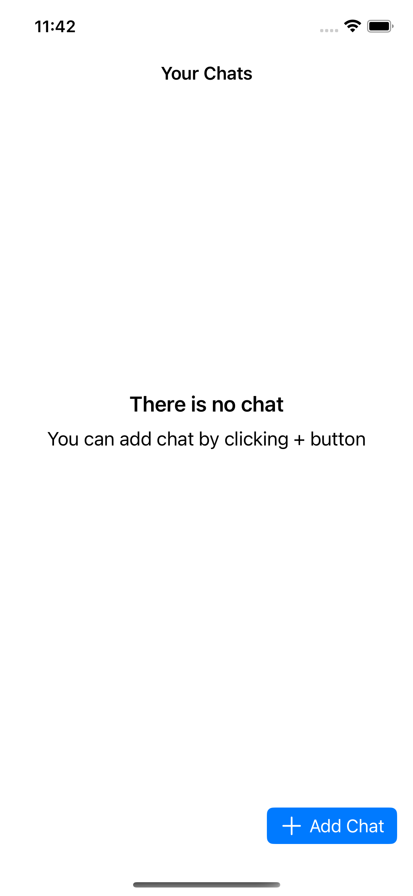
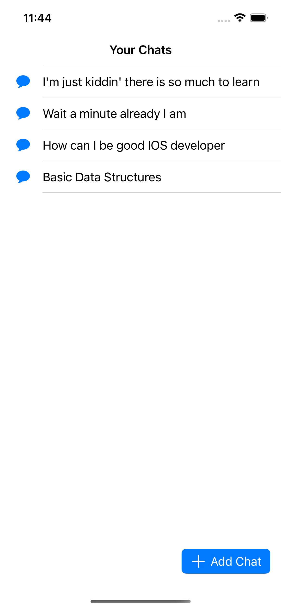
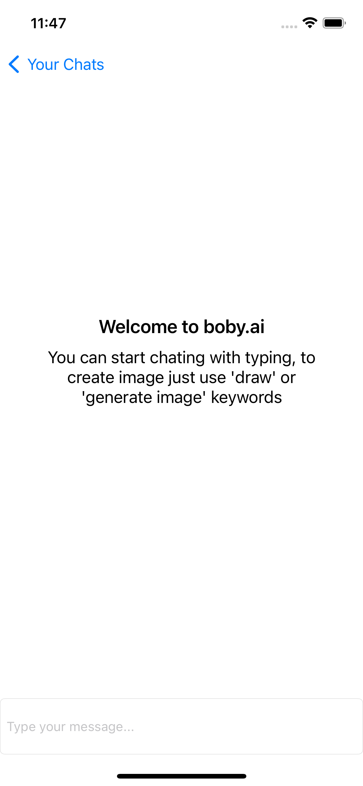
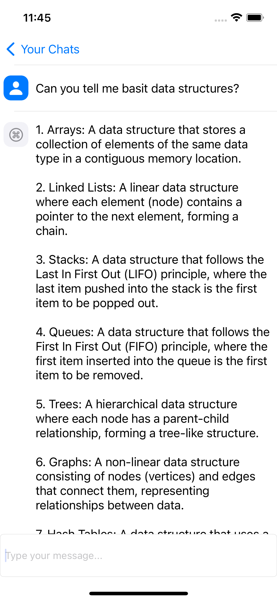
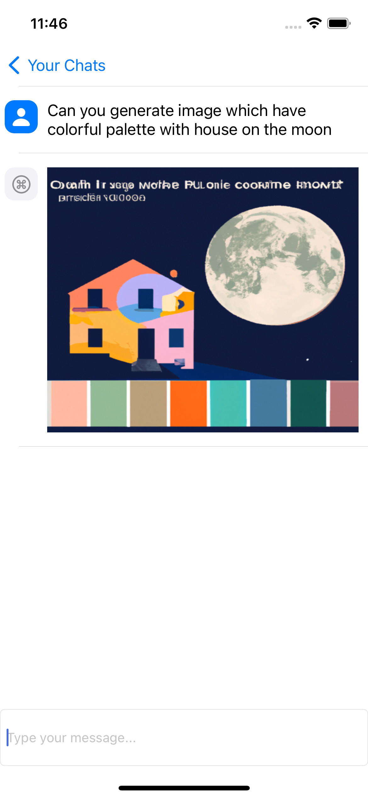

<html>
<body>
    <h1>iOS Developer Case - Chatbot & Image Generation</h1>
    <h2>Project Description</h2>
    
This project is designed to develop an iOS application that allows users to engage in text-based conversations and generate simple images based on specific commands. It also includes features to retain chat history and enable users to open multiple chat tabs.

    <h2>Used Libraries</h2>
    
The main libraries used in this project are:

    <ul>
        <li><a href="https://github.com/Alamofire/Alamofire">Alamofire</a>: An HTTP client library used for making data requests and handling responses.</li>
        <li><a href="https://github.com/onevcat/Kingfisher">Kingfisher</a>: A lightweight and pure-Swift library for downloading and caching images from the web.</li>
    </ul>
    
You can install the libraries with the following commands:

    <h2>OpenAI API Key</h2>
    
To use the OpenAI API in this project, you'll need to store your API key securely. Follow these steps:

    <ol>
        <li>Create a `.env` file at the root of your project.</li>
        <li>In the `.env` file, store your OpenAI API key in the following format:
        <pre><code>OPENAI_API_KEY=your-api-key</code></pre>
        </li>
        <li>Make sure to add the `.env` file to your project's `.gitignore` to keep your API key secret and not push it to your version control system.</li>
    </ol>
    <h2>Application Previews</h2>
    
Below are the working previews of the application:

    <h3>Home Page</h3>
  

    
    
  

    <h3>Chat Screen</h3>
    

    
    
    
  

    <h2>Chatbot Functionality</h2>
    
This application is designed to develop a text-based chatbot using the OpenAI API. The chatbot can engage in natural language conversations and generate responses.

    <h2>Image Generation Capability</h2>
    
The application has the capability to generate simple images based on specific commands. For example, when it receives the command "Draw a cat," the application should generate an image of a cat.

    <h2>Chat History Retention</h2>
    
This application allows users to retain past conversations, enabling them to access their chat history at a later time.

    <h2>Multiple Chat Tabs</h2>
    
The application enables users to open multiple chat tabs and have independent conversations.

    <h2>Getting Started</h2>
    
After downloading the project files, you can run the project by following these steps:

    <ol>
        <li>Clone or download the project to your computer.</li>
        <li>Open the project in Xcode or your preferred IDE.</li>
        <li>Run the application on an iOS device or simulator.</li>
    </ol>
    <h2>Contribution</h2>
    
This project is open-source and open to contributions. Feel free to share your issues or contributions on GitHub.

    

    
For launching the project and further information, please refer to this README. If you have any questions or feedback, don't hesitate to get in touch.

    
<strong>Happy coding!</strong>

</body>
</html>
